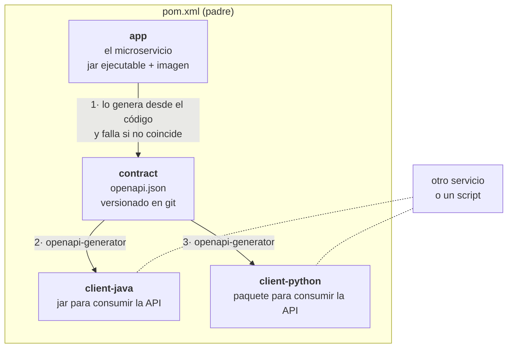

#[[#]]# ${artifactId}

Microservicio Spring Boot generado con el arquetipo base.

- Grupo: `${groupId}`
- Artefacto: `${artifactId}`

#[[##]]# Requisitos mínimos
- JDK 25
- Docker 27+ (para la base de datos local y para los tests de integración con Testcontainers)
- Maven **no** hace falta instalarlo: usa el wrapper `./mvnw`

#[[##]]# Empezando

```shell
make help          # todos los objetivos disponibles
make run           # levanta Postgres/Redis y arranca la aplicación en el 8080
make test          # tests unitarios (*Test.java)
make verify        # tests unitarios + integración (*IT.java, necesita Docker)
```

- API de ejemplo: `GET http://localhost:8080/api/v1/examples/hello`
- Swagger UI: `http://localhost:8080/docs`
- Actuator: `http://localhost:8080/actuator/health`

#[[##]]# Estructura

Es un proyecto **multi-módulo** aunque solo haya un servicio: el contrato y los clientes generados
necesitan vivir en algún sitio, y separarlos después cuesta mucho más que empezar así.



**La flecha 1 es la que manda y solo va en ese sentido.** El contrato no se escribe a mano: sale del
código de `app` y se guarda versionado en `contract`. Si alguien cambia un controlador y no actualiza el
contrato, `OpenApiContractIT` pone el build en rojo — por eso los clientes nunca describen una API que ya
no existe.

Los clientes **no dependen de `contract` por Maven**: leen el `openapi.json` por ruta de fichero. Así el
jar del cliente no arrastra nada del servidor, que es justo lo que no quieres darle a quien te consume.

```
pom.xml            padre: la versión, las versiones de dependencias y los plugins comunes
.mvn/maven.config  el valor por defecto de ${revision} (necesario para poder hacer `mvn -pl`)
app/               EL MICROSERVICIO. Lo único que produce un jar ejecutable y una imagen Docker
  src/main/java/           controladores, servicios, repositorios, entidades, DTOs y mappers
  src/main/resources/      application.yaml y las migraciones de db/migration
contract/          el contrato OpenAPI versionado (src/main/resources/openapi/openapi.json)
client-java/       cliente Java generado del contrato — ver EjemploDeUso para empezar
client-python/     cliente Python generado del contrato — ver ejemplo.py
helm/              el chart de despliegue, con values por entorno
Dockerfile · compose-app.yml · .devcontainer/
```

#[[##]]# Configuración

Un **único** fichero: `app/src/main/resources/application.yaml` (y `app/src/test/resources/application.yaml`
para los tests). El perfil activo por defecto es `dev`.

#[[##]]# Versión del artefacto

La versión del reactor es la propiedad `${revision}`. En local vale `0.0.0-SNAPSHOT`; en CI se pasa desde el
build, normalmente desde el tag de git:

```shell
./mvnw -Drevision=1.2.3 clean install
```

`flatten-maven-plugin` se encarga de que el POM publicado lleve la versión ya resuelta.

#[[##]]# Base de datos y migraciones

El esquema lo gobierna **Flyway**: las migraciones están en `app/src/main/resources/db/migration/` y se
aplican **al arrancar la aplicación**. `ddl-auto` es `validate` en todos los entornos, así que si cambias una
entidad y olvidas la migración, la aplicación no arranca — que es justo lo que quieres que pase.

```shell
make db-baseline   # SOLO la primera vez: genera V1__init.sql desde las entidades
make db-info       # estado de las migraciones (con la app arrancada)
```

Las siguientes migraciones (`V2__...`, `V3__...`) se escriben a mano, y **una ya aplicada no se edita nunca**.
Los datos de prueba no van por Flyway.

#[[##]]# Pruebas

- Unitarias (`*Test.java`) con JUnit 5 y Mockito: no necesitan Docker.
- Integración (`*IT.java`) con **Testcontainers**: levantan su propio Postgres efímero, distinto del de
  desarrollo, para no ensuciar la base con la que estás trabajando.

#[[##]]# Añadir lo que no viene de serie

Este proyecto trae lo que necesita casi cualquier microservicio: API REST con su contrato y sus clientes
generados, base de datos con migraciones, caché, seguridad, trazas y despliegue. **Kafka, WebSocket y
gRPC no vienen dentro a propósito** — cambian la forma de la aplicación y saldría caro que los cargaran
todos los proyectos para que los aprovechen unos pocos.

Para cada uno hay una receta ya probada sobre un proyecto como este, con sus pasos, su test y los
tropiezos que aparecieron al montarla:

- [Kafka](https://github.com/Invarato/archetype-springboot-base-invarato/blob/main/docs/recetas/kafka.md)
- [WebSocket](https://github.com/Invarato/archetype-springboot-base-invarato/blob/main/docs/recetas/websocket.md)
- [gRPC](https://github.com/Invarato/archetype-springboot-base-invarato/blob/main/docs/recetas/grpc.md)

#[[##]]# Licencia

Este proyecto **no trae licencia, a propósito**: el código es tuyo y decides tú. Lo más habitual en un
servicio interno es no ponerle ninguna, y así se queda como todos los derechos reservados.

El arquetipo del que salió es MIT y **su licencia no se hereda**: no tienes que atribuir nada ni
publicar nada. Puedes usar esto en un producto privado, comercial o cerrado.

Si sí vas a publicarlo, entonces sí hace falta elegir: añade un fichero `LICENSE` en la raíz y decláralo
en el `pom.xml` del padre, para que quede también en los artefactos que publiques.

```xml
<licenses>
    <license>
        <name>MIT License</name>
        <url>https://opensource.org/licenses/MIT</url>
    </license>
</licenses>
```
